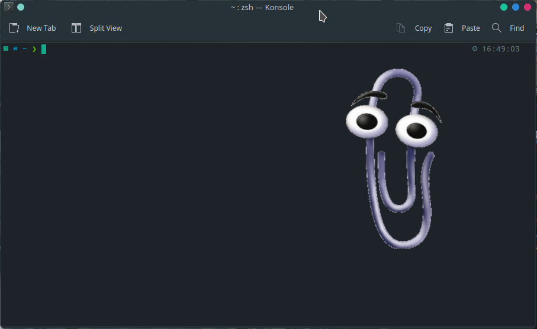

# Scholarly Metadata Workshop

This was a short talk presented at the Scholarly Communications Lab on April 3, 2023.

The talk was organized into two parts:

- What is scholarly metadata and how could *provenance debt* as a concept help to approach it as a beginner?
- Tips on working with scholarly metadata

You can find the slides used for the talk [here](slides/smw_talk.ipynb), and a seperate slideshow on provenance debt [here](https://docs.google.com/presentation/d/1cQoPxYi49n4GuEHsxayrtj3S74BVRrlqRenYpteAIts/edit?usp=sharing).

In the discussion, the idea came up to create a realistic example of a minimal script that might be used in bibliometric research. You can find those materials in the [code-example](code-example/) folder.

## Real-world example

### Chapter 1 - Intro



> Hello *\*name\**!

You're obviously confused but reluctantly stay to listen to the stranger who quite rudely refers to you as \*name\*...

> Congratulations on being selected as one of the research fellows at the prestigous Centre of Bibliometrics Research Excellency. Over the next few weeks, you will learn the in and outs of scholarly communication and the quantitative study of science. Here comes your very first task without any further instructions:

Wait, what? You don't remember applying for any weird scholarships or summer schools. Those gruesome days of grad school lie in a long-distant past. This can't be happening. Not again...

> Senior researchers at our institute have conceptually outlined a novel article-level metric to measure impact, quality, and novelty of research. We are suspecting that the best papers are produced by authors whose names contain certain letter frequencies. To test our hypothesis, we need you to collect relevant metadata for the provided list of DOIs and extract the most common letters and journal title for each article.

You just tried to leave but every door seems to lead back into this room with the creepy academic. Your instincts are screaming and telling you to run but you still remember from last time... You already made it out once and you know that you can leave academia once again. But you need to stay calm and focused.

> Quest difficulty: 5/7
> Reward: 3 course credits
>
> Good luck! My office hours are from sä̸̬̙̟͓́̽͜ď̵̡̟̠͈͋̂̅͑͠ã̶̧̪̩͎̟̖̘ŝ̸̥͓̖ͅf̵̭̳̳͙̤̘͋̾́͊̊̀͐͜d̷̨͈̰̮͌̀͐̏͊̐̓͑ 

The tenured professor finally glitches away into his office and you're left with your laptop and a printed version of the Python documentation.

### Chapter 2 - Picking your class

You stare at your laptop. The cursor simply keeps blinking at you. You wonder if that is the abyss thing that Nietzsche talked about. After a little existential while, when you were just about to give up and use the keyboard to provide some input to the machine, the abyss starts talking to you:

> Oh brave traveller, my name is Clippy and I shall be your guide on your perilous journey. These lands that are unknown have been given many different names: console, shell, command line, or simply *terminal* and I shall, as have my ancestors, guide you through the terminal in the most efficient way.

ఠ_ఠ

oooookay...

> In the past eons, travellers from three different kingdoms set out to conquer these lands of the terminal with their own traditional garbs, tools, and spells. Nowadays, however, thanks to globalism and technological advances all traveling equipment has been standardized. Thus, I would like to strongly suggest to pick the **Bard** as your class of choice.

Clippy does a weird motion with their single arm-like metal limb and in the same moment a note magically appears in front of your face. It's a bit too close to read comfortably.

```
The Bard - A wandering poet who uses [poetry](https://python-poetry.org/)
as their main tool. Poetry allows the bard to effectively reproduce and 
recite their spells independent of their current location and time. 
Furthermore, the bard is known for their love of sharing their poems, 
so that fellow bards can not only enjoy the same buffs but also test and
improve their poems. The bard is super cool!
```

Clippy does the bendy motion again and the note disappears. You're kinda hoping that Clippy isn't planning to show you many other fact-sheets as the metal bend is already dangerously loose.

> Equipping poetry is as easy as using this quick incantation. Come on, give it a try yourself! If you're unsure, you can find more instrucations in [this instructive scroll](https://python-poetry.org/docs/#installation).

```
curl -sSL https://install.python-poetry.org | python3 -
```

### Chapter 2 - Gearing up

### Chapter 3 - Leeeeeeeeroy Jenkins!

### Chapter 4 - Loot

### Credits

Mostly, I want to thank my ADHD for providing the nervous energy and urge to procrastinate which made this undertaking possible.

## License

Use whatever you want and if you let me know I'll probably be happy.